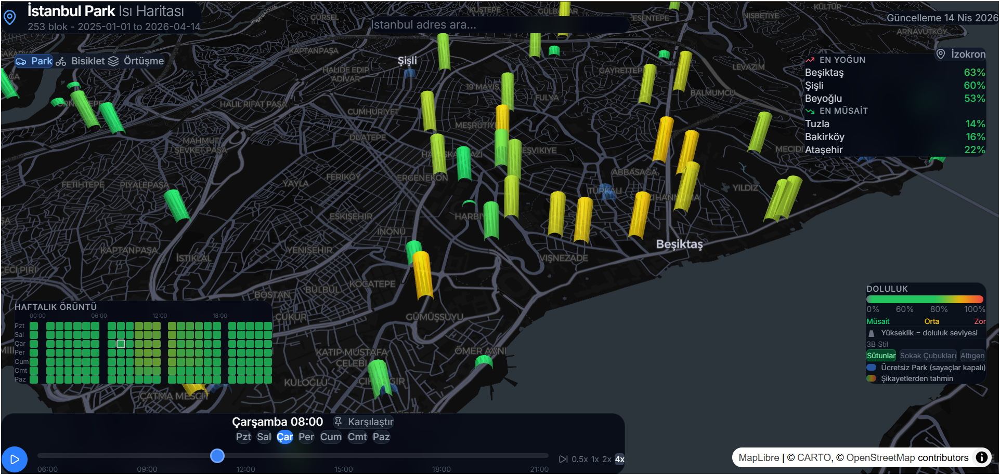
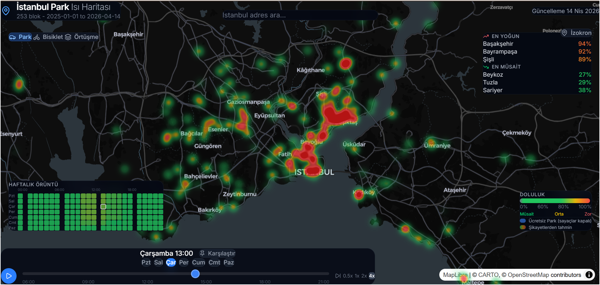

# İstanbul Park Isı Haritası

[](LICENSE)

İstanbul İSPARK otoparkları için zamansal doluluk ısı haritası. Herhangi bir haftanın gününü ve saatini seçin; harita şehirdeki her İSPARK otoparkının tahmini doluluk oranını göstersin — İBB Açık Veri Portalı'ndaki İSPARK API'sinden çekilen gerçek otopark verileri kullanılarak oluşturulmuştur.





## Ne yapar

- **Otopark başına 168 slotluk haftalık profil**: 7 gün × 24 saat doluluk oranı, İSPARK anlık verilerinden türetilir
- **Çok katmanlı görselleştirme**: şehir ölçeğinde ısı haritası → mahalle ölçeğinde 3D sütunlar → sokak ölçeğinde yol segmentleri ve bireysel park yeri noktaları
- **Zaman oynatma**: hafta boyunca kaydırın veya oynat düğmesine basarak talebin nasıl değiştiğini izleyin
- **Otopark detay paneli**: otopark bazında saatlik doluluk dağılımı, kapasite, çalışma saatleri
- **Karşılaştırma modu**: referans zaman dilimini sabitleyin, başka bir dilimle farkları görün
- **Arama + yarıçap**: belirli bir adresi bulun ve çevresindeki park durumunu inceleyin
- **İzokron modu**: bir başlangıç noktası seçin ve N dakikada araba/bisiklet/yürüyüşle ne kadar uzağa gidebileceğinizi görün (yerel Valhalla yönlendirme kullanır — aşağıya bakın)
- **Derin bağlantılı URL durumu**: her seçim (zaman, görünüm, otopark, arama, izokron) URL'de saklanır, böylece her görünüm paylaşılabilir

## Veri kaynakları

Tüm veriler herkese açık, kimlik doğrulama gerektirmeyen uç noktalardan gelir. **Yapılandırılacak API anahtarı yoktur.**

| Kaynak | API | Kullanım amacı |
|---|---|---|
| [İBB Açık Veri Portalı](https://data.ibb.gov.tr) | `api.ibb.gov.tr/ispark/Park` | İSPARK otopark konumları, kapasiteler, anlık doluluk |
| İSPARK API | Anlık doluluk + ilçe/tip çarpanları | 168 slotluk haftalık doluluk profilleri |

Harita altlığı [CARTO Dark Matter](https://carto.com/basemaps/) açık vektör haritasıdır (token gerekmez).

## Teknoloji yığını

- **Frontend**: Vite 7 + React 19 + TypeScript + Tailwind CSS v4
- **Haritalama**: [deck.gl](https://deck.gl) v9 katmanları, [MapLibre GL](https://maplibre.org) üzerinde `react-map-gl` ile
- **Veri hattı**: Python 3 standart kütüphanesi — `requirements.txt` gerekmez
- **Yönlendirme (opsiyonel)**: İzokron hesaplaması için Docker'da çalışan [Valhalla](https://github.com/valhalla/valhalla)

## Kurulum

```bash
# 1. JS bağımlılıklarını kur
pnpm install

# 2. Veriyi çek (tek seferlik, birkaç dakika sürer)
pnpm fetch-data            # İSPARK API'den otopark verisi çeker → public/data/*.json

# Veya pipeline olarak:
pnpm pipeline

# 3. Geliştirme sunucusunu başlat
pnpm dev
```

Ardından http://localhost:5173 adresini açın.

## Proje yapısı

```
istanbul-parking-heatmap/
├── public/data/        # Frontend tarafından kullanılan üretilmiş JSON dosyaları
│   ├── meter_locations.json      # Otopark konumları ve kapasiteleri
│   ├── parking_week.json         # 168 slotluk doluluk profilleri
│   ├── enforcement_schedules.json # Çalışma saatleri
│   └── pressure_311.json         # Basınç skorları
├── scripts/            # Python veri hattı
│   └── fetch_ispark_data.py      # İSPARK API → haftalık profil üretimi
├── src/
│   ├── App.tsx
│   ├── components/     # Harita, paneller, kontroller, ipuçları
│   ├── hooks/          # Veri yükleme, zaman dilimi, URL durumu, izokronlar
│   ├── layers/         # deck.gl katman fabrikaları (zoom seviyesine göre)
│   ├── lib/            # Renk ölçekleri, coğrafi yardımcılar
│   └── types.ts
└── docker-compose.yml  # İzokronlar için opsiyonel Valhalla servisi
```

## Doluluk nasıl hesaplanır

İSPARK API'si (`api.ibb.gov.tr/ispark/Park`) her otopark için anlık `capacity` ve `emptyCapacity` değerlerini döndürür. Veri hattı:

1. **Anlık doluluk oranını hesaplar**: `(capacity - emptyCapacity) / capacity`
2. **İlçe çarpanı uygular**: merkezi ilçeler (Fatih, Beşiktaş, Beyoğlu, Şişli) daha yüksek çarpanla ağırlıklandırılır
3. **Park tipi çarpanı uygular**: yol üstü parklar kapalı otoparklara göre daha yoğun kabul edilir
4. **168 slotluk haftalık profil üretir**: İstanbul'un park alışkanlıklarına uygun saatlik kalıplar (sabah piki, öğle yoğunluğu, akşam trafiği, Cuma akşamı etkisi, hafta sonu azalması)
5. **Çalışma saatlerine göre uygulama takvimi oluşturur**: çalışma saatleri dışında doluluk sıfıra düşer

Sonuç, otopark başına 168 elemanlı bir dizi (`gün * 24 + saat`) olarak tek bir JSON dosyasında sunulur.

## Kullanılabilir komutlar

```bash
pnpm dev                  # Vite geliştirme sunucusu
pnpm build                # Üretim derlemesi (tsc -b && vite build)
pnpm lint                 # ESLint
pnpm preview              # Derlenmiş paketi önizle

# Veri hattı
pnpm fetch-data           # İSPARK API'den veri çek
pnpm pipeline             # Tüm veri hattını çalıştır
```

## Opsiyonel: İzokronlar

İzokron görünümü (herhangi bir noktadan araba/bisiklet/yürüyüş erişilebilirliği) bir yönlendirme motoruna ihtiyaç duyar. Repo, [Valhalla](https://github.com/valhalla/valhalla) için bir `docker-compose.yml` içerir:

```bash
docker compose up -d           # İlk çalıştırmada Türkiye OSM verisini indirir
```

İzokronları umursamıyorsanız, bu adımı atlayın — uygulama sorunsuz çalışmaya devam eder.

## Dikkat edilmesi gerekenler

- **Doluluk tahminidir.** Anlık İSPARK verisi, ilçe/tip çarpanları ve saatlik kalıplar kullanılarak simüle edilir.
- **Sadece İSPARK otoparkları.** Özel otoparklar ve sokak üzeri düzensiz park veride yoktur.
- **Tipik hafta, gerçek zamanlı değil.** Veri hattı İSPARK anlık verisinden tipik bir haftalık profil üretir; canlı akış yoktur.
- **Çalışma saatleri otopark bazındadır.** Çalışma saatleri dışında doluluk sıfır olarak gösterilir.

## Lisans

MIT — [LICENSE](LICENSE) dosyasına bakın.

## Acknowledgments

- [DataSF](https://datasf.org/opendata/) for publishing the meter transaction dataset
- [deck.gl](https://deck.gl), [MapLibre](https://maplibre.org), and [CARTO basemaps](https://carto.com/basemaps/) for the open mapping stack
- [Valhalla](https://github.com/valhalla/valhalla) for the routing engine
